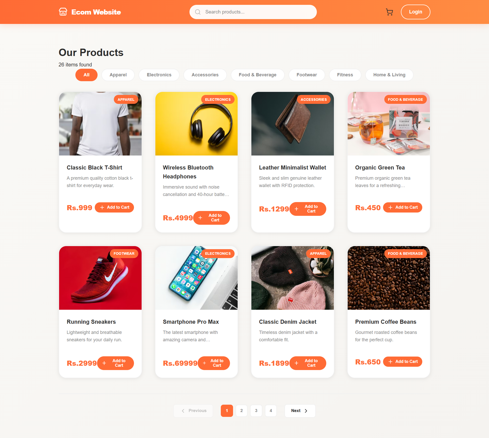
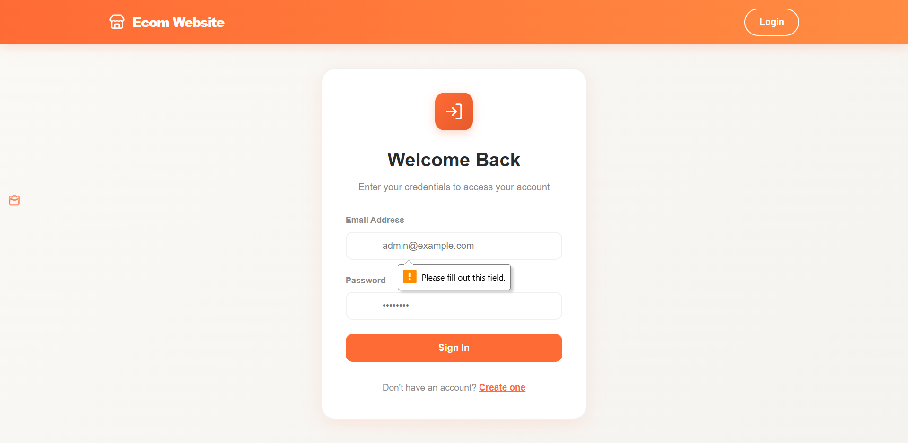
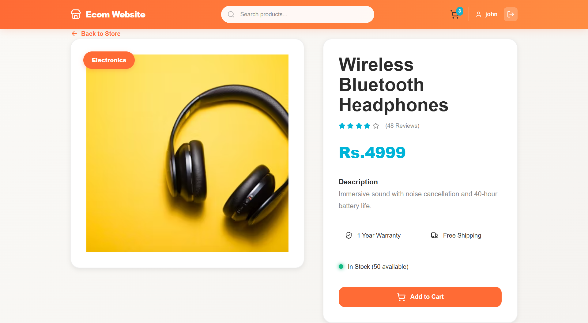
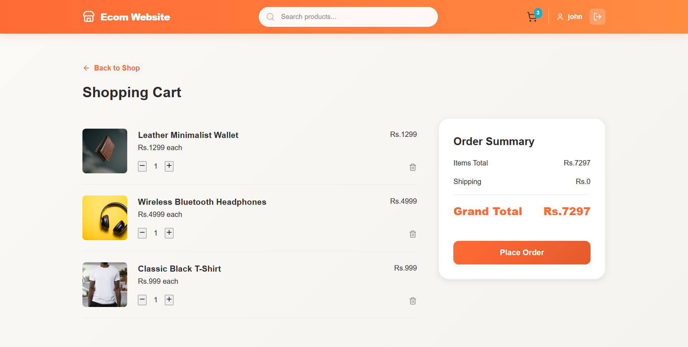

# Mini E-Commerce Website

A full-stack e-commerce application built with React, Express.js, and MongoDB. This project demonstrates a complete e-commerce workflow including user authentication, product management, shopping cart functionality, and more.

## 🌟 Features

- **User Authentication**
  - User registration and login with JWT authentication
  - Secure password hashing with bcryptjs
  - Protected routes and middleware authentication

- **Product Management**
  - Browse products with detailed information
  - Upload new products (admin functionality)
  - Product details page with full specifications
  - Dynamic product catalog

- **Shopping Cart**
  - Add/remove products from cart
  - View cart with all items
  - Cart persistence with context API
  - Real-time cart updates

- **Responsive Design**
  - Mobile-friendly interface
  - Modern UI with Lucide React icons
  - Smooth navigation with React Router

## � Screenshots

### Home Page


### Login Page


### Product Details


### Shopping Cart


## �🛠️ Tech Stack

### Frontend
- **React 19** - UI library
- **Vite** - Build tool and dev server
- **React Router v7** - Client-side routing
- **Axios** - HTTP client for API requests
- **Context API** - State management
- **Lucide React** - Icon library
- **CSS3** - Styling

### Backend
- **Express.js** - Web framework
- **Node.js** - JavaScript runtime
- **MongoDB** - NoSQL database
- **Mongoose** - MongoDB ODM
- **JWT** - Authentication
- **bcryptjs** - Password hashing
- **CORS** - Cross-origin resource sharing
- **Multer** - File upload handling

## 📁 Project Structure

```
mini-ecommerce-website/
├── public/                 # Static assets
├── server/                 # Backend server
│   ├── config/
│   │   └── db.js          # Database configuration
│   ├── controllers/
│   │   └── userController.js
│   ├── middleware/
│   │   └── authMiddleware.js
│   ├── models/
│   │   ├── Cart.js
│   │   ├── Product.js
│   │   └── User.js
│   ├── routes/
│   │   ├── cartRoutes.js
│   │   ├── productRoutes.js
│   │   └── userRoutes.js
│   ├── utils/
│   │   └── generateToken.js
│   ├── index.js           # Server entry point
│   ├── seeder.js          # Database seeder
│   └── package.json
├── src/                    # Frontend source code
│   ├── api/
│   │   └── index.js       # API configuration
│   ├── assets/            # Images and static files
│   ├── components/
│   │   ├── Navbar.jsx
│   │   └── ProductCard.jsx
│   ├── context/
│   │   ├── AuthContext.jsx
│   │   ├── CartContext.jsx
│   │   └── ProductContext.jsx
│   ├── pages/
│   │   ├── Home.jsx
│   │   ├── Login.jsx
│   │   ├── Register.jsx
│   │   ├── ProductDetails.jsx
│   │   ├── CartPage.jsx
│   │   └── UploadProduct.jsx
│   ├── App.jsx            # Root component
│   ├── main.jsx           # React entry point
│   └── index.css
├── index.html
├── package.json
├── vite.config.js         # Vite configuration
└── eslint.config.js       # ESLint configuration
```

## 🚀 Getting Started

### Prerequisites

- **Node.js** (v14 or higher)
- **npm** or **yarn**
- **MongoDB** (local or cloud instance)

### Installation

1. **Clone the repository**
   ```bash
   git clone https://github.com/Srinugithu/mini-ecommerce-website-reatchall.git
   cd mini-ecommerce-website
   ```

2. **Install frontend dependencies**
   ```bash
   npm install
   ```

3. **Install backend dependencies**
   ```bash
   cd server
   npm install
   cd ..
   ```

### Environment Configuration

Create a `.env` file in the `server` directory with the following variables:

```env
PORT=5000
MONGODB_URI=mongodb://localhost:27017/ecommerce
JWT_SECRET=your_jwt_secret_key_here
NODE_ENV=development
```

For frontend, create a `.env` file in the root directory:

```env
VITE_API_BASE_URL=http://localhost:5000
```

## 🎯 Running the Project

### Start the Backend Server

```bash
cd server
npm start        # Production mode
# or
npm run dev      # Development mode with nodemon
```

The backend will run on `http://localhost:5000`

### Start the Frontend Development Server

In a new terminal, from the root directory:

```bash
npm run dev
```

The frontend will run on `http://localhost:5173`

### Database Seeding

To populate the database with sample data:

```bash
cd server
npm run data:import
```

To clear the database:

```bash
npm run data:destroy
```

## 📡 API Endpoints

### Authentication Routes
- `POST /api/users/register` - Register a new user
- `POST /api/users/login` - Login user
- `GET /api/users/profile` - Get logged-in user profile (protected)

### Product Routes
- `GET /api/products` - Get all products
- `GET /api/products/:id` - Get product details
- `POST /api/products` - Create new product (protected)
- `PUT /api/products/:id` - Update product (protected)
- `DELETE /api/products/:id` - Delete product (protected)

### Cart Routes
- `GET /api/cart` - Get user's cart (protected)
- `POST /api/cart` - Add item to cart (protected)
- `PUT /api/cart/:id` - Update cart item (protected)
- `DELETE /api/cart/:id` - Remove item from cart (protected)

## 🔐 Authentication

The application uses JWT (JSON Web Tokens) for authentication:

1. User registers or logs in
2. Server generates a JWT token
3. Token is stored in localStorage on the client
4. Token is sent with protected API requests via Authorization header
5. Server validates token using authentication middleware

## 🎨 Key Components

### AuthContext
Manages user authentication state and provides login/logout functionality across the application.

### CartContext
Handles shopping cart state, including adding/removing items and cart management.

### ProductContext
Manages product data and provides product listing and details throughout the app.

## 🔧 Available Scripts

### Frontend
- `npm run dev` - Start development server
- `npm run build` - Build for production
- `npm run preview` - Preview production build
- `npm run lint` - Run ESLint

### Backend
- `npm start` - Start server
- `npm run dev` - Start with auto-reload
- `npm run data:import` - Seed database
- `npm run data:destroy` - Clear database

## 🤝 Contributing

Contributions are welcome! To contribute:

1. Fork the repository
2. Create a feature branch (`git checkout -b feature/AmazingFeature`)
3. Commit your changes (`git commit -m 'Add some AmazingFeature'`)
4. Push to the branch (`git push origin feature/AmazingFeature`)
5. Open a Pull Request

## 📝 License

This project is licensed under the ISC License - see the LICENSE file for details.

## 👨‍💻 Author

**Srinivas**

- GitHub: [@Srinugithu](https://github.com/Srinugithu)

## 🙏 Acknowledgments

- Built with React and Express.js
- Inspired by modern e-commerce platforms
- Special thanks to all contributors and supporters

## 📞 Support

For support, email or open an issue on the GitHub repository.

---

**Note:** This is a mini e-commerce project for educational purposes. For production use, ensure proper security measures, error handling, and comprehensive testing.
